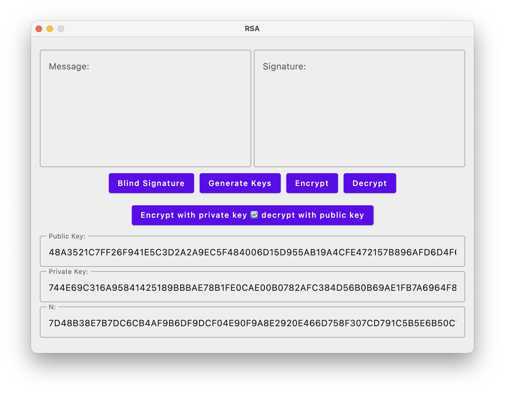
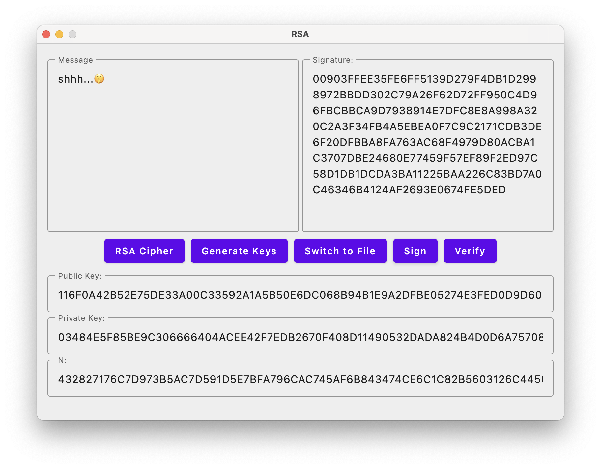

# 🔐 RSA Cipher Implementation

This is a simple implementation of the RSA cipher algorithm built using **Kotlin**, `BigInteger`, and **Kotlin Compose for Desktop**.  
It allows you to generate RSA key pairs, encrypt and decrypt messages, sign and verify digital signatures, and even experiment with **blind signatures**.

## ⚙️ Functionality

- 🗝️ Generate RSA key pairs (public & private)
- ✉️ Encrypt and decrypt messages using RSA
- ✍️ Digitally sign messages
- ✅ Verify message signatures
- 🕶️ Create and verify **blind signatures**
- 🔄 Encrypt with private key / decrypt with public key
- 💾 Switch between direct input and file-based encryption
- 🖥️ GUI built with Kotlin Compose for Desktop

## 🖼️ Screenshots

**Standard Mode:**

**Advanced Mode with Blind Signature:**

## 📚 Resources

Resources used to implement this project:

- [YouTube: RSA Algorithm Explained Visually](https://www.youtube.com/watch?v=D_PfV_IcUdA)
- [YouTube: RSA Encryption - Computerphile](https://www.youtube.com/watch?v=nvcssTsiavg)
- [YouTube: RSA Full Explanation](https://www.youtube.com/watch?v=CcB9nH78Ths)
- [YouTube: How RSA Works Practically](https://www.youtube.com/watch?v=F5Pi5qVrt0U)

## 📝 Notes

My notes on the RSA cipher algorithm:

  
